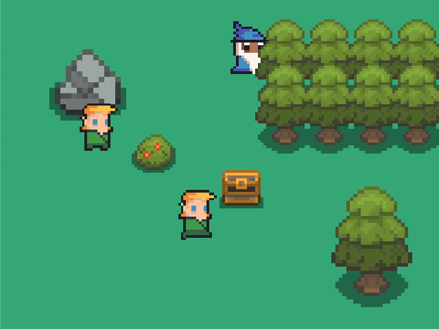
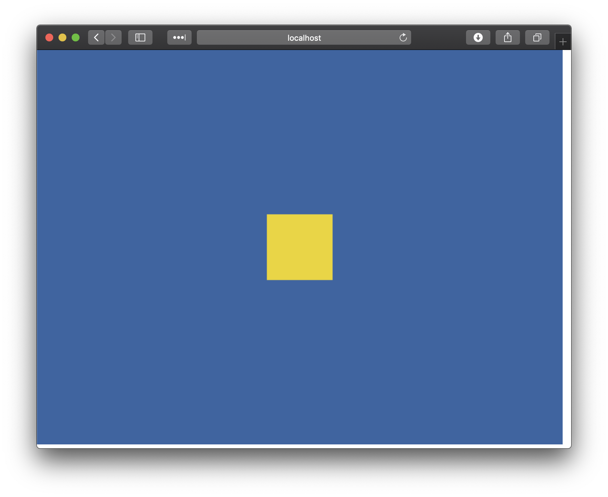

# ryannhg/elm-2d
> a package for building games in WebGL



## install

```bash
elm install ryannhg/elm-2d
elm install avh4/color
```

## an example

```elm
module Examples.Shapes exposing (main)

import Color
import Elm2D


main =
    Elm2D.view
        { background = Color.blue
        , size = ( 800, 600 )
        }
        [ Elm2D.rectangle
            { color = Color.yellow
            , position = ( 350, 250 )
            , size = ( 100, 100 )
            }
        ]

```




### even more examples

You can see more interesting examples in this project's `examples` folder. Clone this repo and run:

```
elm reactor
```

The examples will be available at http://localhost:8000

