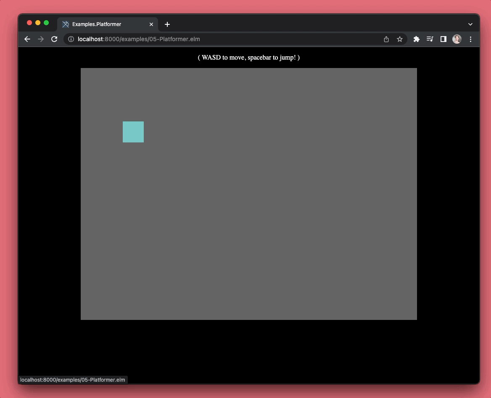

# ryannhg/elm-2d
> a package for building games in WebGL


## install

```bash
# ( 👇 this command won't work unless I publish this! )
elm install ryannhg/elm-2d
```

## a simple example

```elm
module Examples.Shapes exposing (main)

import Elm2D exposing (Html)
import Elm2D.Color


main : Html msg
main =
    Elm2D.view
        { background = Elm2D.Color.fromRgb255 ( 0, 0, 100 )
        , size = ( 800, 600 )
        }
        [ Elm2D.rectangle
            { color = Elm2D.Color.fromRgb255 ( 200, 200, 0 )
            , position = ( 350, 250 )
            , size = ( 100, 100 )
            }
        ]
```


## even more examples

You can see more interesting examples in this project's `examples` folder. Clone this repo and run:

```
cd examples/
elm reactor
```

The examples will be available at http://localhost:8000

### 2. Images

An example of how to render images from a file, instead of just colors and shapes.

[(Source code here)](./examples/02-Images.elm)


### 3. Spritesheets

An example of how to use more advanced features like selecting multiple tiles in a spritesheet.

[(Source code here)](./examples/03-Spritesheets.elm)


### 4. Animations

An example of how to use `Elm2D.Spritesheet.Animation` to make characters bounce and run around.

[(Source code here)](./examples/04-Animations.elm)


### 5. Platformer

An example with keyboard support, where players can move something you've rendered.

[(Source code here)](./examples/05-Platformer.elm)



### 6. Dungeon

An example of creating a dungeon from a tileset.

[(Source code here)](./examples/06-Dungeon.elm)


